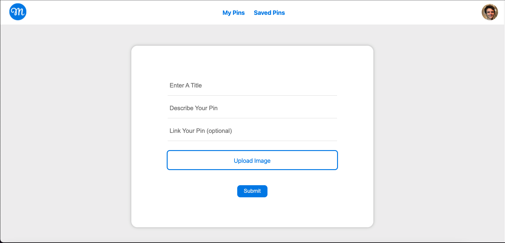
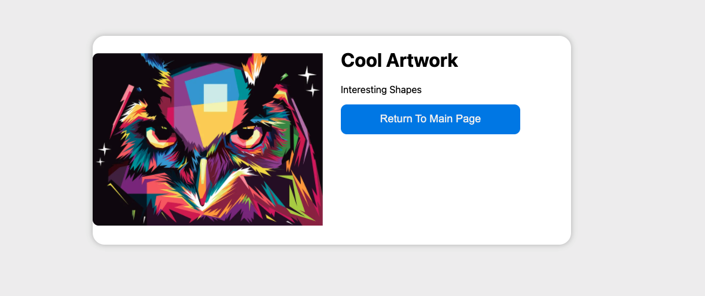

# Pinterest Clone

<!-- ABOUT THE PROJECT -->

## About The Project

<!-- [![Product Name Screen Shot][product-screenshot]](https://example.com) -->

There are many good ideas of projects used with the main purpose of learning a technology. A good side project is always one that isn't too complicated, but allows you to learn the basic syntax of the technologies used and a bit of how to structure an application with those technologies. A Pinterest Clone is a good example of that. In this project you will practice tha basics of creating a GraphQL API (CRUD, Project Structure, Best Practices...).

Here Are Some Features In the Project:

- Users can **login** to their account with a simple email / password login.
- Users can create new posts to their wall.
- A post will contain an image, a description, and a title.
- Users can **delete** their posts.
- Users can save other peoples posts.
- A wall with the posts from every user.

### Technologies Used:

- ReactJS
- NodeJS
- GraphQL
- Apollo Client
- Any database you want (MongoDB recommended)
- Cloudinary (for storing pictures)

#### **Note: All the services above are free to use**

## Starter Code:

The code provided already sets up the client and the server. The GraphQL setup is done and one type is already created (the user type). Use the starter code provides a good start to the project, but you will need to do a lot on your own. If you are wondering how to structure the project, I put some pictures of mine Pinterest clone down below.

### Main Page

### Create Pin Page

### When you click on a Pin

